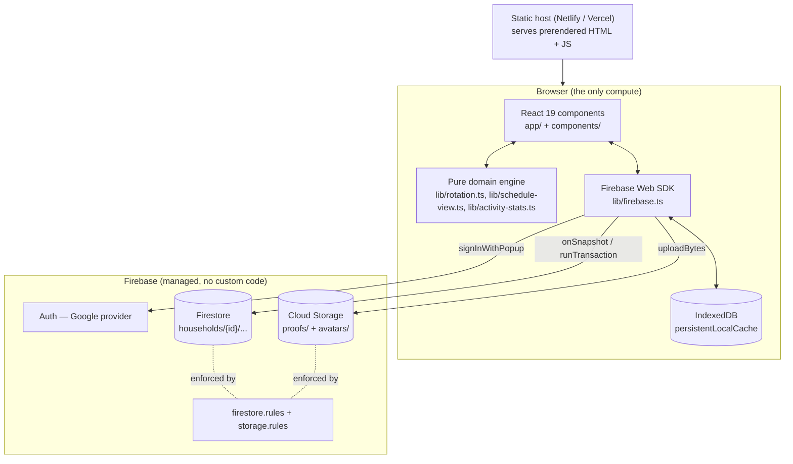
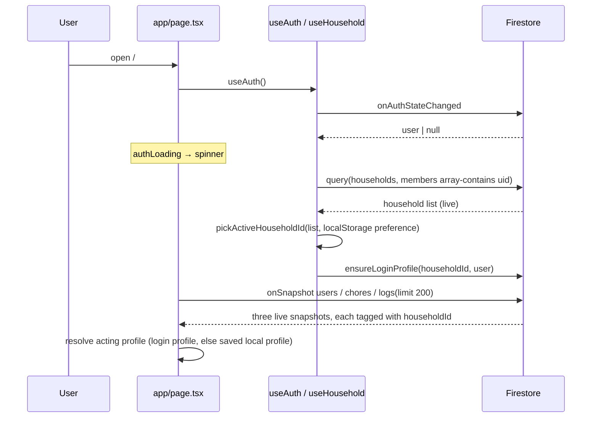
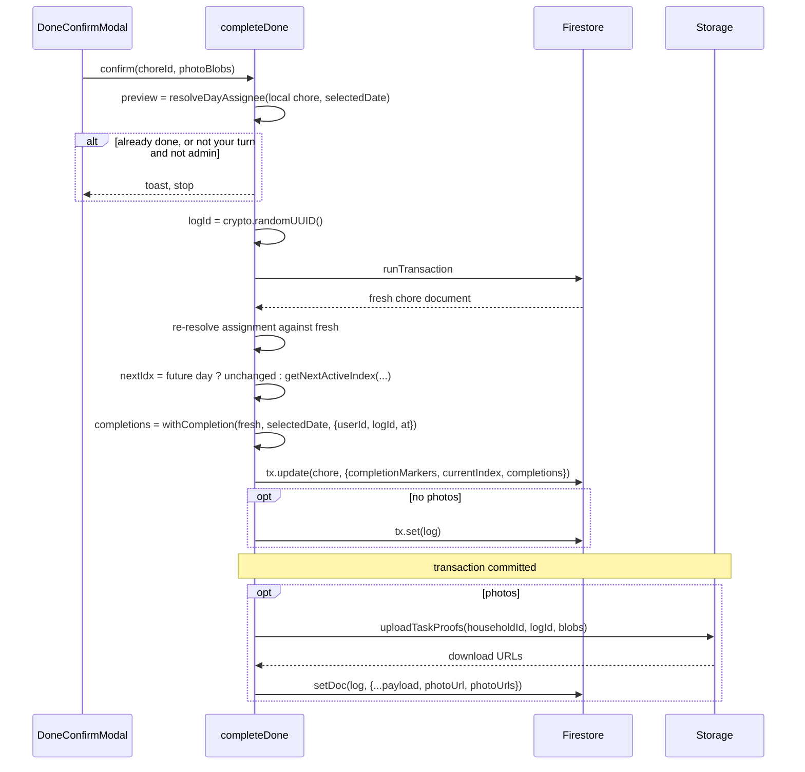
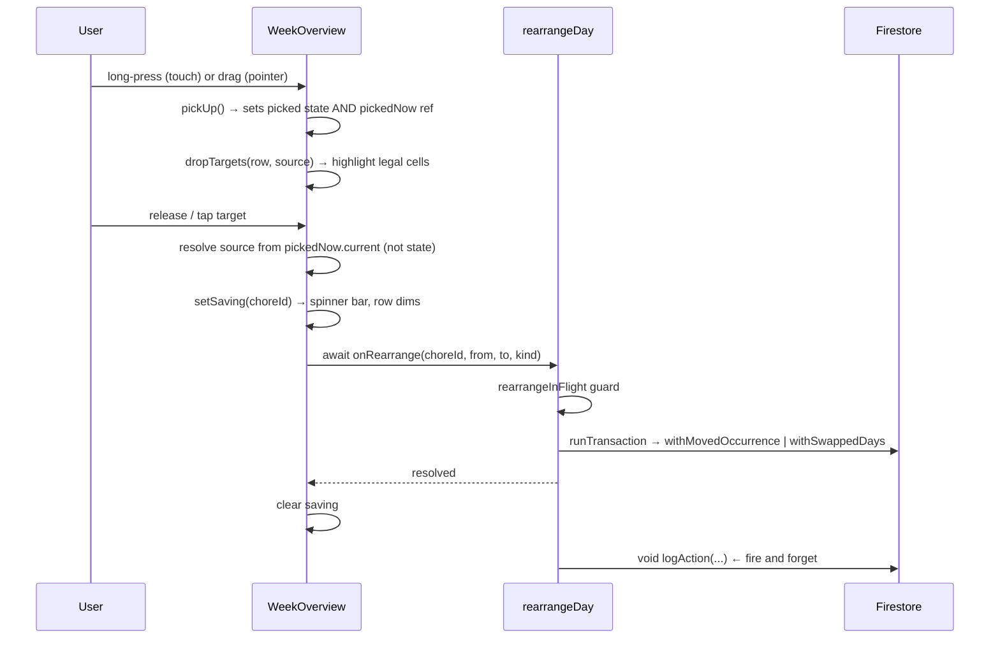

# System Architecture and Design

A map of the codebase for someone who has never seen it. Every claim below is
tied to code that exists today.

Related documents: [HOW-IT-WORKS.md](HOW-IT-WORKS.md) explains the domain rules
and *why* they are the way they are. [README.md](README.md) explains how to run
it. [ROADMAP.md](ROADMAP.md) explains what is deliberately absent.
[DEFECTS.md](DEFECTS.md) lists open bugs.

---

## 1. System Overview & Core Functionality

### What it is

A household shares recurring chores. The app decides whose turn each chore is
on each day, records what people actually did, and shows the result as a day
list and a week grid. The UI is Hebrew, right-to-left, and installable as a
PWA.

### What it does

| Capability | Where it lives |
|---|---|
| Sign in with Google, one account across many households | `lib/hooks.ts` (`useAuth`, `useHousehold`) |
| Create, join, rename, leave a household | `lib/hooks.ts` |
| Manage residents: name, colour, avatar photo, absence window | `app/page.tsx` settings tab |
| Manage chores: name, frequency, rotation order | `app/page.tsx` (`renderChoreForm`, `handleSaveChore`) |
| Decide whose turn a chore is, on any date, past or future | `lib/rotation.ts` (`resolveDayAssignee`) |
| Render a day list and a week grid from one resolution | `lib/schedule-view.ts` (`buildScheduleRows`) |
| Mark done, undo, skip, undo skip, write off, undo write-off | `app/page.tsx` handlers, all inside Firestore transactions |
| Move or trade a day by dragging in the week grid | `components/WeekOverview.tsx` + `rearrangeDay` in `app/page.tsx` |
| Attach up to 3 proof photos to a completion | `lib/storage-upload.ts`, `components/TaskModals.tsx` |
| Activity feed with reactions and comments | `app/page.tsx` history tab, `components/Reactions.tsx` |
| Per-person activity chart over 7/14/30 days | `lib/activity-stats.ts`, `components/ActivityChart.tsx` |
| Local "it's your turn" reminders | `lib/notifications.ts` |

### The one architectural fact that explains everything else

**There is no server.** No API routes, no Cloud Functions, no scheduled jobs.
The browser talks to Firestore directly through the client SDK, and Firestore
Security Rules are the only thing standing between a user and the data.

The consequence that shapes the whole design: **state is derived on read, never
written.** Whether a day is overdue, who owes it, and what is outstanding are
recomputed from stored facts every time they are displayed. Persisting them
would require some browser to write the record at midnight — several open tabs
would race, and a household that did not open the app would leave holes. The
only things stored are things a person actually did.

---

## 2. High-Level Architecture

### Runtime topology



Next.js is used as a build tool and a PWA shell, not as a server. All three
routes prerender to static output.

### Technology

| Layer | Choice | Version (`package.json`) |
|---|---|---|
| Framework | Next.js App Router | `^15.4.9` |
| UI | React | `^19.2.1` |
| Language | TypeScript, `strict: true` | `5.9.3` |
| Styling | Tailwind CSS v4 (PostCSS plugin) | `4.1.11` |
| Animation | `motion` (Framer Motion successor) | `^12.23.24` |
| Icons | `lucide-react` | `^0.553.0` |
| Backend | `firebase` web SDK — Auth, Firestore, Storage | `^12.17.1` |
| Tests | `node:test` + `node:assert/strict`, `@firebase/rules-unit-testing` | — |

### Routes

There is one screen. `app/page.tsx` is a single `'use client'` component that
renders all three tabs.

| Route | Source | Rendering |
|---|---|---|
| `/` | `app/page.tsx` | Static shell, all data client-fetched |
| `/manifest.webmanifest` | `app/manifest.ts` | Static |
| `/_not-found` | Next.js default | Static |

`app/layout.tsx` sets `<html lang="he" dir="rtl">`, loads the Rubik font, and
wraps everything in `ToastProvider` and `InstallPrompt`.

### Directory map

```
app/
  page.tsx        3,146 lines — the entire application shell and every write handler
  layout.tsx      RTL root, font, ToastProvider, InstallPrompt
  manifest.ts     PWA manifest
  globals.css     Tailwind entry

lib/              Pure logic + Firebase plumbing. Everything here is unit-testable.
  rotation.ts     730 lines — THE domain engine. Recurrence, absence, rotation
                  pointer, completions map, all immutable update helpers.
  schedule-view.ts  The one projection both views render from. Cell states,
                  drag/drop targets, missed-occurrence lookback, day strip.
  activity-stats.ts Per-day / per-person tallies for the history chart.
  activity.ts     Human-readable log line formatting (Hebrew).
  hooks.ts        useAuth, useHousehold — auth and household lifecycle.
  household-utils.ts  Pure identity helpers (ids, storage keys, photo merge).
  firebase.ts     SDK init, emulator wiring, persistent cache.
  storage-upload.ts / image.ts   Photo compression and upload paths.
  reactions.ts    Reaction catalogue + comment shape, mirroring firestore.rules.
  notifications.ts  Local (not push) reminders.
  auth-errors.ts  Maps Firebase auth error codes to Hebrew messages.
  utils.ts        DEAD — `cn()` is never imported.

components/       Presentational. No Firestore imports; they take props and
                  emit callbacks.
  WeekOverview.tsx   653 lines — week grid, drag-and-drop and pick-and-place.
  TaskModals.tsx     630 lines — PhotoPicker, Done/Skip/Swap/QuickTask/
                     ManualLog/DeleteLog modals.
  Reactions.tsx      Reaction bar and comment thread.
  ActivityChart.tsx  Stacked per-day bars with a tappable breakdown.
  MultiSelectFilter.tsx  Shared multi-select dropdown (people, tasks).
  Avatar.tsx         The only way to draw a person. Photo, else initial.
  Toast.tsx          Context provider + useToast.
  CollapsibleSection.tsx, InstallPrompt.tsx

hooks/
  use-mobile.ts   DEAD — `useIsMobile` is never imported.

scripts/          Node test files and dev tooling
  rotation.test.ts, schedule-view.test.ts, activity-stats.test.ts,
  household-utils.test.ts   → npm run test:unit
  rules.test.ts             → npm run test:rules (spins up emulators)
  seed-emulator.ts          → npm run seed
```

### Data model

One document tree per household. Firestore paths:

```
households/{householdId}
  ├─ ownerId : string          the single elevated role
  ├─ members : string[]        auth uids, max 20
  └─ name?   : string
     ├─ users/{userId}         resident profile
     │    name, color, isAbsent, linkedAuth,
     │    photoURL?, absentFrom?, absentUntil?
     ├─ chores/{choreId}
     │    name, frequency, rotation[], currentIndex,
     │    customDays?, category?, anchorDate?, startDate?, onceDate?,
     │    lastCompletedAt?, lastCompletedLogId?,
     │    completions? : { 'YYYY-MM-DD': ChoreCompletion }
     └─ logs/{logId}
          userId, actorUid, action, details, timestamp,
          choreId?, photoUrl?, photoUrls?, reactions?, comments?
```

**`chore.completions` is the whole mutable state of a chore.** One record per
resolved or rearranged day, keyed by local date. `ChoreCompletion` in
`lib/rotation.ts` defines the flags:

| Field | Meaning |
|---|---|
| `userId`, `at`, `logId` | who and when |
| `skipped` | turn handed on, day still owed |
| `cancelled` | written off without being done |
| `movedTo` / `movedFrom` | linked pair relocating an occurrence |
| `swappedWith` | the other day of a one-day trade |
| `assignedTo` | this one day handed to someone, without touching `rotation` |
| `pending` | scheduling metadata only; nothing was done |

Because a record always carries a `userId`, "did somebody actually do this?"
cannot be answered by looking at `userId`. It is answered by
`isCompletedRecord` — see §3.

### Identity model

Two distinct concepts that are easy to conflate:

- **A resident is not an account.** A `users/{id}` document is a profile. Some
  are linked to a Google account (`linkedAuth: true`, document id = auth uid),
  some are not, so a shared kitchen tablet can act as any resident.
- Every log therefore carries **both** `userId` (the profile it is attributed
  to) and `actorUid` (the Google account that wrote it). The rules pin
  `actorUid == request.auth.uid`, so nobody can write a record as someone else
  even though anyone may act as any profile.
- **The owner is the only admin.** `household.ownerId` gates skipping,
  swapping, cancelling, rearranging, and all chore/resident editing. Any member
  may mark a chore done on their own turn.

The acting profile is resolved in `app/page.tsx` (~line 366): prefer the
resident whose id equals the auth uid, otherwise restore a local profile from
`localStorage` under a per-auth key from `profileStorageKey`.

### Security model

`firestore.rules` enforces three things and deliberately does not enforce a
fourth.

1. **Membership** — `isMember` / `isOwner` do a `get()` on the household
   document. Everything under `households/{id}/` requires membership.
2. **Document shape** — `isValidChoreStrict`, `isValidUser`, `isValidLog`
   validate types, sizes, and **exact key count**. See §5 for why the key count
   is a hazard.
3. **Authorship** — `actorUid == request.auth.uid` on log create and on each
   appended comment. Reactions may only touch the caller's own uid
   (`isReactionUpdate`). Comments may only be appended one at a time
   (`isCommentAppend`).
4. **Not enforced: whose turn it is.** Rotation is projected from the
   completions map and absence windows, which Rules cannot compute. Any member
   can drive the queue through the SDK. This is stated in a comment at the top
   of `firestore.rules` and accepted in `ROADMAP.md`.

Non-owner chore updates are narrowed by field:

```
allow update: if isMember(householdId) && isValidChoreStrict(incoming())
  && ( isOwner(householdId)
     || incoming().diff(existing()).affectedKeys()
          .hasOnly(['currentIndex','lastCompletedAt','lastCompletedLogId','completions']) );
```

`storage.rules` uses cross-service `firestore.get()` for membership, and makes
proof photos write-once (`resource == null`), so evidence cannot be replaced.

### Build and deploy

`npm run build` produces a static export served by Netlify or Vercel.
`firestore.rules` and `storage.rules` are **not** part of that deploy — they
ship separately with `firebase deploy --only firestore:rules`. Forgetting this
is a real failure mode: a client that writes a new chore field will fail
silently until the rules catch up.

---

## 3. Design Patterns Used

### 3.1 Pure core, imperative shell

**Where:** everything in `lib/` except `firebase.ts`, `hooks.ts` and
`storage-upload.ts` is pure. `app/page.tsx` holds every Firestore call.

**Why:** `lib/rotation.ts` and `lib/schedule-view.ts` encode rules that are
genuinely hard — a rotation pointer that walks past frozen days while honouring
absence windows. Keeping them free of I/O is what makes
`scripts/rotation.test.ts` (557 lines) and `scripts/schedule-view.test.ts` (463
lines) possible with plain `node:test` and no emulator.

The project convention in `.cursor/rules/project-conventions.mdc` makes this
explicit: pure logic goes in `lib/`, its test in `scripts/<name>.test.ts`,
registered in the `test:unit` script.

### 3.2 Recurrence rule + exceptions (the iCalendar `RRULE`/`EXDATE` shape)

**Where:** `choreOccursOnDate` in `lib/rotation.ts:163`.

A chore stores a *rule* (`frequency`, `anchorDate`, `customDays`, `startDate`,
`onceDate`), and `completions` stores *exceptions* to it. The function
evaluates them in a fixed order:

1. `startDate` gate — a chore was not due before it existed.
2. `movedTo` on this day → the occurrence left, return `false`.
   `movedFrom` on this day → an occurrence landed here, return `true`.
3. Otherwise apply the recurrence rule.

**Why here specifically:** the comment in the source says it — putting the gate
and the relocation check inside `choreOccursOnDate` means *every* reader
inherits both. The day view, the week grid, the occurrence walk, and the
rotation projection that consumes one turn per open occurrence all call this
one function. There is no second place to forget.

**Trade-off:** no occurrence rows exist in the database, so there is nothing to
query, index, or migrate — but also nothing a server could act on. The cost is
that a year-long walk evaluates the rule ~365 times per chore, which is why the
`completions` map lookup on line 175 is guarded by `if (chore.completions)`.

### 3.3 Derive on read, never persist derived state

**Where:** `missedOccurrences` in `lib/schedule-view.ts:225`, and the whole
`CellState` resolution.

Nothing writes "overdue" or "missed". `missedOccurrences` walks
`MISSED_LOOKBACK_DAYS` (14) days backwards on render and collects cells that
resolve to `overdue`.

**Why:** the doc comment states the reasoning. With no server, a stored
"missed" record would have to be written by whichever tab happened to be open
at midnight. Several tabs would race to write the same record, and a household
that did not open the app that week would leave holes in its own history. A
derived answer costs nothing and cannot drift.

### 3.4 Single shared projection (one source of truth per concern)

**Where:** `buildScheduleRows` in `lib/schedule-view.ts`, consumed by both the
day list and the week grid in `renderTasks`.

Both views call it once, through one shared `ScheduleFilters` object, and the
week grid also feeds `components/WeekOverview.tsx` from the same rows.

**Why:** the two views were previously assembled independently from `Chore` and
drifted apart — the original bug that motivated the module. The project
conventions now name three concerns and their single source:

| Concern | Render through | Never |
|---|---|---|
| Day list and week grid | `buildScheduleRows` | Assemble from `Chore` directly |
| Who did what | `chore.completions` | The activity log |
| A person's icon | `components/Avatar.tsx` | A hand-rolled circle with `name.charAt(0)` |

### 3.5 Extracted predicate over duplicated flag checks

**Where:** `isCompletedRecord` in `lib/rotation.ts:328`.

```ts
export const isCompletedRecord = (record: {
  skipped?: boolean; cancelled?: boolean;
  movedTo?: string | null; pending?: boolean;
}) => !record.skipped && !record.cancelled && !record.movedTo && !record.pending;
```

Called by `getCompletion`, `completionMarkers`, `resolveDayAssignee` (via
`getDayRecord`), and `activityByDay`.

**Why:** this is remediation of a real bug, documented in its own doc comment.
Every reader used to spell out the flags meaning "not done". Each new flag had
to be added to all of them at once, and the reader that was missed counted
skipped days as completions in the activity chart. Adding the next flag is now
a one-line change in one place.

The convention file states the rule directly: *never ask "is this real work" by
listing the flags that mean it is not.*

### 3.6 Immutable rebuild helpers for the completions map

**Where:** `withCompletion`, `withoutCompletion`, `withMovedOccurrence`,
`withSwappedDays`, `withoutRearrangement` in `lib/rotation.ts`.

Each takes a chore and returns a **new** completions map.

**Why:** Firestore replaces map fields wholesale — there is no partial map
update — so every writer has to rebuild the entire map anyway. Centralising
that rebuild is what lets three cross-cutting concerns be handled once instead
of at five call sites:

- **Pruning** runs on every rebuild (`pruneCompletions`).
- **Scheduling metadata survives outcomes.** `schedulingFields` (line 423)
  preserves `movedTo`/`movedFrom`/`assignedTo`/`swappedWith` when an outcome is
  written or undone. Dropping `movedFrom` when completing a relocated day would
  take the day off the calendar along with the completion just written to it.
- **Undo is not deletion.** `withoutCompletion` leaves a `pending` placeholder
  behind when the day was moved or swapped, so undoing work does not also undo
  the relocation.

### 3.7 Linked-pair records written atomically

**Where:** `withMovedOccurrence` (line 476) writes `movedTo` on the source day
and `movedFrom` on the destination in one map; `withSwappedDays` (line 508)
writes `assignedTo` + `swappedWith` on both days.

**Why:** both halves land in a single document update, so the schedule can
never be observed half-moved. Each half is also designed to stand alone —
`movedTo` suppresses its day, `movedFrom` creates one — so if pruning removes
the partner the schedule still reads correctly and only the provenance is lost.
`pruneCompletions` (line 400) additionally drops a `pending` half whose partner
did not survive, because a lone `movedFrom` would otherwise leave the day it
came from occurring again alongside it.

### 3.8 Optimistic concurrency via transactions

**Where:** `completeDone`, `handleUndoDone`, `cancelDay`, `undoCancelDay`,
`rearrangeDay`, `handleUndoSkip`, `completeSkip` in `app/page.tsx` — all wrap
`runTransaction(db, async (tx) => ...)`.

The shape is consistent:

1. A **cheap preview check** off local state, so the common rejection is
   instant (`completeDone` line 739).
2. Inside the transaction, `tx.get(choreRef)`, then **re-decide against the
   stored document** with `resolveDayAssignee(fresh, ...)`.
3. Return a discriminated result `{ ok: false, reason: 'turn' | 'done' | 'missing' }`
   rather than throwing, so the caller maps reasons to Hebrew toasts.

**Why:** every write rebuilds the whole completions map. Two people finishing
the same chore, or one person double-tapping on two devices, would each write
back a map built from their own stale copy and silently drop the other's days.

### 3.9 Denormalised fields kept honest by a derived helper

**Where:** `completionMarkers` in `lib/rotation.ts:595`, spread into every
chore update as `...completionMarkers(completions)`.

`lastCompletedAt` and `lastCompletedLogId` are a denormalised copy of the newest
completed entry, kept for the health indicator and for readers that predate the
map. Recomputing them from the map on every write means the two representations
cannot disagree. `getDayRecord` reinforces this: once a chore has a completions
map, the map is the only source of truth and `lastCompletedAt` is ignored.

### 3.10 Snapshot scoping to prevent cross-household leakage

**Where:** `app/page.tsx:236`.

```ts
const [usersSnap, setUsersSnap] = useState<{ householdId: string; users: UserType[] } | null>(null);
const users = usersSnap?.householdId === householdId ? usersSnap.users : [];
```

Each Firestore snapshot is stored **with the household id it came from**, and
read back only if the id still matches. The same pattern appears in
`useHousehold` (`snap.userId !== userId`) and in the acting-profile scope
(`${user.uid}:${householdId}`).

**Why:** switching households leaves the previous listener's data in state for
a tick. Without the guard the new household would briefly render the old
household's residents. It also derives `loading` for free:
`snap?.userId !== userId`.

### 3.11 Provider + hook for cross-cutting UI

**Where:** `components/Toast.tsx` — `ToastProvider` mounted in
`app/layout.tsx`, consumed via `useToast()`, which throws if used outside the
provider.

**Why:** every write handler needs to report failure, and toasts must render
above everything regardless of which subtree raised them.

### 3.12 Custom hooks as the Firebase boundary

**Where:** `useAuth` and `useHousehold` in `lib/hooks.ts`.

`useHousehold` owns a non-trivial lifecycle: an `array-contains` query for the
user's households, `localStorage` persistence of the active one, a
`pickActiveHouseholdId` fallback, and an effect that calls `ensureLoginProfile`
whenever a household is opened. The page component receives a flat result
object and never touches auth or household documents directly.

### 3.13 `useSyncExternalStore` for SSR-safe reads of browser state

**Where:** `app/page.tsx:321` for reminder state, and in
`components/WeekOverview.tsx` for pointer capability detection.

```ts
const noopSubscribe = () => () => {};
const remindersOn = useSyncExternalStore(noopSubscribe, () => remindersEnabled(), () => false);
```

**Why:** `remindersEnabled()` reads `localStorage` and `Notification.permission`,
neither of which exists on the server. The third argument gives the server
snapshot, so markup matches on hydration. The empty subscribe is deliberate: the
whole page already re-renders on every Firestore update and interaction, so no
separate effect or state is needed.

### 3.14 Refs as synchronous guards

Three instances, each solving the same class of bug — React state updates are
not synchronous, so a second event in the same tick reads a stale value.

| Ref | Location | Bug it prevents |
|---|---|---|
| `loginInFlight` | `lib/hooks.ts:93` | Two clicks both read `loggingIn === false` and open two popups; Firebase rejects the first with `auth/cancelled-popup-request` |
| `rearrangeInFlight` | `app/page.tsx:307` | Two drops in the same tick both pass. Deliberately **not** the shared `actionBusy` flag, which is held across every other action and silently discarded drops |
| `pickedNow` | `components/WeekOverview.tsx` | A fast drag finishes before React commits the pick-up state, so the drop resolves against `null` and is thrown away |

### 3.15 Structural typing for a narrow dependency

**Where:** `RotationUser` in `lib/rotation.ts:70`.

```ts
// Structural subset of the app's UserType, so any richer profile works here.
export type RotationUser = { id: string; isAbsent?: boolean; absentFrom?: string | null; absentUntil?: string | null };
```

The engine declares only the four fields it reads. `UserType` in `app/page.tsx`
is structurally assignable, so the engine never depends on the UI's shape and
tests can pass minimal objects.

### 3.16 Backward compatibility as a first-class rule

Every optional field has a documented "what a missing value means":

| Missing | Reads as |
|---|---|
| `startDate` | The schedule has no lower bound (pre-`startDate` behaviour) |
| `anchorDate` | Fall back to `lastCompletedAt`, then to the caller's reference day |
| `absentFrom`/`absentUntil` | Fall back to the boolean `isAbsent`, treated as always-on |
| `completions` (with `lastCompletedAt` set) | A legacy single marker; `getDayRecord` returns `inferred: true` and the assignee is a best guess |
| `actorUid` on a log or comment | Written before the binding existed; required on write only, and updates never re-validate the whole document |

**Why:** documents written by older clients are still live in production. The
convention file states the rule: *fields written before a change must keep
working — treat a missing field as the old behaviour.*

### 3.17 Bounded growth by pruning on write

**Where:** `pruneCompletions` in `lib/rotation.ts:390`, called by every `with*`
helper. Caps at `COMPLETIONS_MAX_AGE_DAYS` (180) and
`COMPLETIONS_MAX_ENTRIES` (366).

**Why:** the map lives inside the chore document, and `firestore.rules` caps it
at 400 keys. Exceeding it would make every subsequent write fail validation. The
constants are set below the ceiling on purpose. Note the consequence in §5: the
history floor is ragged, not a clean line.

### 3.18 Constants mirrored between client and rules

`LOG_DETAILS_MAX = 200` in `lib/activity.ts`, `COMMENT_MAX_LENGTH = 200` and
`COMMENTS_MAX = 30` in `lib/reactions.ts`, and the `REACTIONS` catalogue each
carry a comment saying they mirror `firestore.rules`. `clampDetails` truncates
before the write rather than letting the rules reject it.

**Why:** the rules are the enforcement, but a rejected write surfaces as an
opaque `permission-denied`. Clamping client-side turns a hard failure into a
truncated string. This mirroring is manual and unverified — see §5.

---

## 4. Key Workflows

### 4.1 Boot and household resolution



Three unconditional listeners are opened per household in one effect
(`app/page.tsx:324`) and torn down together when `householdId` changes. Only the
logs query is limited (`LOG_FEED_LIMIT = 200`, ordered by `timestamp desc`);
users and chores load in full.

### 4.2 Rendering the schedule

```
users + chores + selectedDate + filters
        │
        ▼
buildScheduleRows(chores, users, days, filters, today)   ← lib/schedule-view.ts
        │  per chore, per day:
        │    choreOccursOnDate()      → occurs at all?
        │    getDayRecord()           → any recorded outcome?
        │    resolveDayAssignee()     → who owns it, frozen or projected
        │    → CellState: none | done | cancelled | unavailable | overdue | open
        ▼
ScheduleRow[]  ──┬─→ day list   (renderTasks, app/page.tsx)
                 └─→ week grid  (components/WeekOverview.tsx)
```

`resolveDayAssignee` is the single entry point for "who owns this chore on this
day". Its two rules:

1. A **completed** occurrence is frozen to the recorded person. It never follows
   the pointer and never reacts to a later absence.
2. An **uncompleted** occurrence is projected forward from `currentIndex` by
   `projectAssigneeIndex`, consuming one turn per open occurrence and skipping
   residents whose absence window covers the day it lands on.

So `currentIndex` means "who takes the next open occurrence", and recorded days
are fixed points the projection re-anchors on as it walks past them.

The carry-over badge on today's card calls `missedOccurrences`, which repeats
the same resolution for the previous 14 days and keeps the cells that came back
`overdue`.

### 4.3 Mark a chore done (with photos)

The most involved write path. `completeDone`, `app/page.tsx:729`.



Three details that are easy to miss:

- **The log is written after the upload when photos are attached.** Logs are
  append-only in the rules, so URLs cannot be patched in afterwards. The chore
  is already committed at that point, so a failed upload shows *"the task was
  saved but the photo upload failed"* and still writes the log without URLs.
- **Completing a future day does not move the pointer** (`isFutureDay`), so
  finishing Saturday's turn early cannot steal the turn from the days between.
- **Every action applies to `selectedDate`, not to today.** A backdated
  completion is flagged in the log line by `joinDetails`.

### 4.4 Skip, cancel, and undo

| Action | Writes | Pointer |
|---|---|---|
| Skip (`completeSkip`) | `{ skipped: true }` on the day | Advances |
| Cancel (`cancelDay`) | `{ cancelled: true }` on the day | Untouched — a written-off day takes no turn |
| Undo done (`handleUndoDone`) | `withoutCompletion` | `currentIndexAfterUndo` |
| Undo skip / undo cancel | `withoutCompletion` | `currentIndexAfterUndo` |

**A skip does not settle the day.** It hands the turn to the next resident and
leaves the day open, so it still reads as `open` or `overdue` and is still owed.
Cancelling is the only way to close a day without claiming it was done.

`currentIndexAfterUndo` (line 570) is the subtle one. Handing the turn back is
only correct when nothing was recorded after that day — a later completion or
skip already moved the pointer past it, and rewinding would hand the same turn
out twice. It also ignores `pending` records, because a day that was merely
moved or swapped left the queue where it was.

### 4.5 Drag a day in the week grid



**Semantics** (`DropKind` in `lib/schedule-view.ts`): dropping on an empty day
**moves** the occurrence, keeping the resident who owed it. Dropping on another
resident's day **trades** the two. Neither settles a day — they only relocate
it, and the pair between them consumes exactly one turn, so nothing else in the
rotation shifts.

**Interaction:** pick-and-place (long-press, then tap a target) for touch, real
drag for pointer devices, chosen by a `useSyncExternalStore` pointer-capability
check.

**Dragging is disabled while a person filter is on**, because the grid draws
another resident's day as an empty cell and that would look like free space.

The `saving` indicator exists because the grid renders only server-confirmed
state. Without it, `dragSnapToOrigin` returned the avatar to its start and the
move appeared a moment later, which read as the drag having failed.

### 4.6 History tab

```
chores (full set, live)
   │
   ├─ activityByDay(chores, userIds, windowDays, today)   ← counts completions
   │     filters with isCompletedRecord — skipped and cancelled days are not work
   │     returns DayTally[] with per-user counts AND the entries behind them
   │
   ├─ activityTotals(days, userIds) → legend, busiest first
   ├─ busiestDay(days)              → bar scale
   │
   └─→ components/ActivityChart.tsx — stacked bars, tap a bar for a breakdown
```

Filters behave asymmetrically on purpose: **people and days drive both the chart
and the log feed; the task filter drives only the chart.** The reason is in the
data — `logAction` writes no `choreId`, so a log record generally has no chore
to filter on, while the chart reads the completions map where the chore is the
key. History filter state (`historyPersonIds`, `historyChoreIds`) is kept
separate from the tasks tab's filters so narrowing history does not silently
change the tasks tab.

`feedTruncated` detects when the chosen window reaches further back than the 200
loaded logs — the oldest record held is still newer than the window start — and
the tab says so rather than presenting a short list as complete.

**The chart counts `chore.completions`, never the log.** The log is the wrong
source for statistics: it is capped at 200 records with no date filter, and it
is append-only, so undoing a completion writes a second record rather than
removing the first.

### 4.7 Adding a field to a chore

Not a runtime workflow, but the one development workflow that will break
silently if done wrong. `isValidChoreStrict` validates by **exact key count**, so
a new field needs three coordinated edits:

1. the `hasX` line and the `totalSize` sum in `isValidChoreStrict`
2. a type/size check for the field
3. a case in `scripts/rules.test.ts`

...and then `firebase deploy --only firestore:rules`. Miss any of these and
every chore write starts failing with `permission-denied`.

---

## 5. Known Limitations & Potential Issues

### Architectural

**Turn ownership is not enforced.** Rotation is projected from data Rules cannot
compute, so any member can drive the queue through the SDK directly. Identity is
bound and every action is logged, so nobody can act *as* someone else, but the
queue itself is advisory. Enforcing it would mean moving completion into a Cloud
Function. Accepted deliberately; documented in `firestore.rules` and
`ROADMAP.md`.

**The household document is readable by any signed-in user who knows its id** —
`allow get: if isSignedIn()`. The join flow needs it before the joiner is a
member. The stated fix is a separate join-code document holding only what the
join screen needs.

**Rules deploy separately from the app.** A client release that writes a new
field will fail silently in production until `firebase deploy --only
firestore:rules` runs. There is no check that the deployed rules match the repo.

**`storage.rules` depends on an IAM grant.** The cross-service
`firestore.get()` calls only work once the Cloud Storage service agent has
`roles/firebaserules.firestoreServiceAgent`. Without it every call returns null
and every rule denies. Deploying interactively prompts for the grant, so this
file must never be deployed with `--non-interactive`.

### Data and scale

**History has a ragged floor.** Completions are pruned to 180 days / 366 entries
*on write*, so pruning only runs when that chore is written to. A chore in daily
use loses old days that a dormant one still keeps. Two chores in the same
household can have different history depths.

**The log feed is the most recent 200 records with no pagination.** A wide date
range can outrun it; the history tab says so when it does. Note `ROADMAP.md`
still says 50 in two places — the constant is `LOG_FEED_LIMIT = 200`.

**Users and chores load unlimited.** `onSnapshot(collection(...))` with no
`limit()`. Fine at the ~20-member cap the rules impose, but a household that
accumulates hundreds of chores loads all of them on every open.

**Every Firestore change re-renders the entire page.** `app/page.tsx` is one
component holding all state, and the schedule projection runs inside render.
`buildScheduleRows` walks 7 days × N chores, and the carry-over badge walks
another 14 days per chore. There is no `useMemo` on the projection.

**A once-a-minute clock tick forces a full re-render** (`setClockTick`,
line 266) so absence windows roll over without a reload.

**`getCountFromServer` runs on every delete-log confirmation open** to get the
true count of older records. It is a billed read and is not cached.

### Offline

**Photos taken offline are dropped.** `persistentLocalCache` queues Firestore
writes, but Storage has no offline queue, so a completion made without a
connection saves the chore and loses the picture.

**No sync indicator.** A queued offline write looks identical to a saved one.

**Transactions have no timeout.** Offline, `runTransaction` does not resolve.
`actionBusy` and the week grid's `saving` state stay set, and the row stays
dimmed with no way out except a reload.

### Error handling

**Save failures are reported as a generic toast, or not at all.**
`DEFECTS.md` records the open case: a rejected write surfaces as
`permission-denied` in the console and a Hebrew toast that does not say which
field was invalid. When a chore field is added without the three rules edits,
this is exactly what the user sees.

**Snapshot listener errors only `console.error`.** All three listeners in
`app/page.tsx:324` log and leave the previous state in place, so a permission
failure renders as an empty or stale household with no message.

**No React error boundary.** An exception in the projection or in any render
path blanks the whole app.

### Tech debt

| Item | Detail |
|---|---|
| `app/page.tsx` is 3,146 lines | One component holds all state, every Firestore handler, and three tab renderers (`renderTasks`, `renderHistory`, `renderSettings`). Every change touches the same file. |
| `eslint.ignoreDuringBuilds: true` | Set in `next.config.ts`. Lint failures do not block a production build. |
| Known lint baseline | `npx eslint app components lib scripts` reports 3 pre-existing errors: `set-state-in-effect` in `app/page.tsx`, two `refs`-during-render in `components/TaskModals.tsx`. `npm run lint` additionally walks the committed `.netlify` output and reports unresolvable-rule errors there. |
| Dead code | `lib/utils.ts` (`cn`) and `hooks/use-mobile.ts` (`useIsMobile`) are defined and never imported. `clsx` and `tailwind-merge` exist only to serve `cn`. |
| Unused dependencies | `@google/genai`, `@hookform/resolvers`, `class-variance-authority` have zero references in source. |
| `sharp` is missing | `scripts/generate-icons.mjs` cannot run. |
| `.env.example` | Documents variables no code reads. |
| Client/rules constants are mirrored by hand | `LOG_DETAILS_MAX`, `COMMENT_MAX_LENGTH`, `COMMENTS_MAX`, the reaction id list, and the completions caps each duplicate a number in `firestore.rules`. Nothing verifies they stay in step. |
| `category` is a parallel filter | `CHORE_CATEGORIES` drives a chip row in the chore form and a second chip row above the day list, filtering by `selectedCategoryFilter`. It sits alongside the shared `choreFilterIds` multi-select rather than being folded into it, so the tasks tab has two independent task filters. |
| No component tests | `test:unit` covers `lib/` only. `WeekOverview`'s drag state machine — the source of several fixed race conditions — has no automated coverage. |
| Service worker does not prompt a reload | A new version activates silently; the open tab keeps the old bundle. |

### Product gaps flagged in `ROADMAP.md`

Reminders are local notifications from an open tab, not push — nothing arrives
in the background, and on iOS nothing arrives at all. Fairness is counted, not
effort-weighted. There is no cover-request flow, so only the owner can move a
turn.
