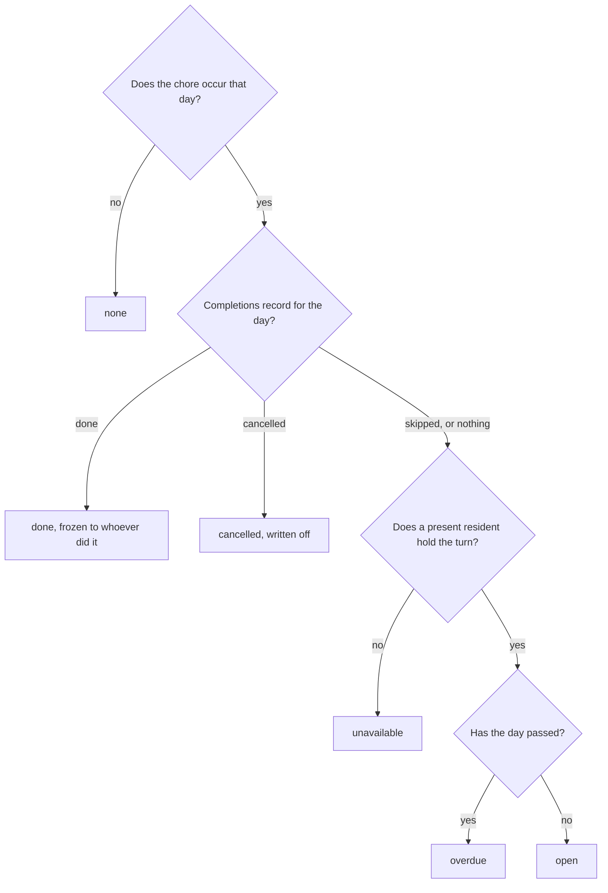

# How it works

What the app does and why it is built this way. [README.md](README.md) covers
running it; [ROADMAP.md](ROADMAP.md) covers what is deliberately not built yet.

This document describes rules, not code. Names of modules appear where a reader
would want to go next, but nothing here should need editing because a function
moved.

## What it is

A household shares recurring chores. The app decides whose turn each chore is on
each day, records what was actually done, and shows the result as a day list and
a week grid. It is in Hebrew, right-to-left, and installable as a PWA.

The hard part is not the list. It is that people go away, swap turns, forget a
day, and then argue about whose fault it was. Most of the design below exists to
make yesterday's answer stay true.

## There is no server

Everything runs in the browser against Firestore. There is no backend process,
no scheduled job, and nothing that wakes up at midnight.

The consequence worth internalising: **state is derived on read, not written.**
Whether a day is overdue, who owes it, and what is outstanding are all computed
from stored facts every time they are displayed.

Persisting them instead would mean some browser has to write the record. Which
browser? Several open tabs would race to write the same one, and a household
that did not open the app that week would leave holes in its own history. A
derived answer costs nothing to compute and cannot drift.

Stored facts are only the things a person actually did.

## The data

One Firestore document tree per household, at `households/{id}`:

| Collection | Holds |
|---|---|
| the household document | name, `ownerId`, `members` |
| `users` | resident profiles: name, colour, photo, absence window |
| `chores` | the schedule, the rotation, and every recorded day |
| `logs` | the activity feed, with photos, reactions and comments |

Two distinctions are easy to get wrong.

**A resident is not an account.** A `users` document is a profile in the
household. Some are linked to a Google account, some are not, so a shared tablet
in the kitchen can act as any of them. Every log record therefore carries both
`userId`, the resident it is attributed to, and `actorUid`, the Google account
that actually wrote it. The security rules verify `actorUid`, so nobody can
write a record as someone else even though anyone can act as any profile.

**The owner is the admin.** `household.ownerId` is the only elevated role. Any
member may mark a chore done on their own turn; skipping, swapping, writing a
day off, and editing chores or residents are the owner's.

## How a turn is decided

Two rules drive the whole rotation engine, and they live in `lib/rotation.ts`:

1. **A completed occurrence is frozen** to the person recorded against that day.
   It never follows the rotation pointer and never reacts to a later absence. A
   trip booked next week cannot rewrite who did the dishes yesterday.
2. **An uncompleted occurrence is projected** forward from `chore.currentIndex`,
   consuming one turn per open occurrence and skipping residents whose absence
   window covers the day that occurrence lands on.

So `currentIndex` means "who takes the next open occurrence", and the recorded
days are fixed points the projection re-anchors on as it walks past them.

Whether a chore occurs on a given day at all is decided by three fields:

- `frequency` is `daily`, `weekly`, `custom_days`, or `once`. Weekly repeats
  every seven days from `anchorDate`; `custom_days` lists weekday numbers;
  `once` occurs on `onceDate` and then never again.
- `anchorDate` is what a repeat counts from, fixed when the chore is created.
  Without it a weekly chore has nothing stable to repeat from.
- `startDate` is the first day the chore exists. This is why adding a chore on a
  Thursday does not immediately show three missed days earlier that week.

Absence is a datetime range, `absentFrom` to `absentUntil`, evaluated per day
rather than as a flag. The boolean `isAbsent` is still written alongside it as a
mirror of "away right now", for the security rules and for older readers, but no
rotation decision reads it.

## What a day can be

Every chore-and-day pair resolves to exactly one state. Both views render from
the same resolution in `lib/schedule-view.ts`, which is why they cannot disagree
about a date.

`unavailable` means the turn landed on nobody who can take it: the rotation is
empty, everyone in it is away, or the resident holding it has been deleted.

The question that actually matters is **which states still owe work**. `done`
and `cancelled` are settled. `overdue` is owed, and today's card says so with a
carry-over badge tracing up to two weeks back.

**A skip is not a state, and it does not settle anything.** Skipping hands the
turn to the next resident and leaves the day itself open, so it still reads as
open or overdue and is still owed. Cancelling is the only way to write a day off
without claiming it was done. Without that distinction, an occurrence nobody
ever got to would stay outstanding forever.

## What you can do to a day

The whole of a chore's mutable state is `completions`, a map keyed `YYYY-MM-DD`,
plus the `currentIndex` pointer. Every action below is a write to one or both,
and each is also appended to the activity log.

| Action | Who | Effect |
|---|---|---|
| Mark done | the assignee, or the owner | Records the day against the person, moves the pointer on. Optional proof photos. |
| Undo done | whoever completed it, or the owner | Removes the record and returns the pointer to them. |
| Skip | owner | Records the day as skipped and moves the pointer on. The day stays owed. |
| Undo skip | owner | Removes the record and returns the turn. |
| Write off | owner | Records the day as cancelled against whoever owed it. Takes no turn, so the pointer is untouched. |
| Undo write-off | owner | Removes the record; the day is owed again. |
| Move a day | owner | Drag a day in the week grid onto an empty one. The occurrence stops falling on the first and starts falling on the second, keeping the resident who owed it. |
| Trade two days | owner | Drag a day onto another resident's day in the same row. Both keep their occurrence and the two residents exchange them. |
| Swap | owner | Exchanges two residents' positions in the rotation. Note this is permanent, not a one-day trade. |
| One-off task | owner | Creates a `once` chore on the day being viewed, for an extra round of something. |
| Manual entry | any member | Writes a log record with no chore behind it. |

Completing or skipping a future day deliberately does not move the pointer, so
finishing Saturday's turn early cannot steal the turn from the days in between.

Moving and trading are the two that do not settle a day, they only relocate it.
Each writes a linked pair of records, and the pair between them consumes exactly
one turn, so neither changes what the rotation does on any other day. A traded
day in particular keeps the queue where it was even after it is completed:
taking Monday off someone is a favour, not a claim on Tuesday as well.

Dragging is disabled while a person filter is on, because the grid draws another
resident's day as an empty cell and that would look like free space.

Marking done, undoing, skipping and writing off all run inside a Firestore
transaction, re-deciding against the stored document. Two people finishing the
same chore at once would otherwise each write back a whole completions map built
from their own stale copy, and one would silently drop the other's day.

Every action applies to the day being viewed, not to today.

## The three tabs

**Tasks** shows a day list and a week grid. Both are built by one call to
`buildScheduleRows`, through one shared set of filters, so whatever the grid
shows in a column is what the day list shows for that date.

**History** shows a per-person activity chart above the log feed. The chart
counts `chore.completions`, not the log. The log is the wrong source for
statistics: it is capped at the most recent records with no date filter, and it
is append-only, so undoing a completion writes a second record rather than
removing the first. Anything that answers "who did what" reads the completions
map.

**Settings** covers residents, chores, absence windows, household membership and
reminders.

## Limits worth knowing

- **History has a floor.** A chore's completions are pruned on write, to 180
  days or 366 entries. It is also ragged rather than a clean line, since pruning
  only runs when that chore is written to: a chore in daily use loses old days
  that a dormant one still keeps.
- **The log feed is the most recent 200 records**, with no pagination. A wide
  date range can outrun it, and the history tab says so when it does.
- **Turn ownership is client-side.** Rotation is projected from data that
  security rules cannot compute, so any member can drive the queue through the
  SDK. Identity is bound and every action is logged, so nobody can act as
  someone else, but the queue itself is not enforced.

`ROADMAP.md` has the rest of the known limitations and the reasoning for the
features that are deliberately absent.
